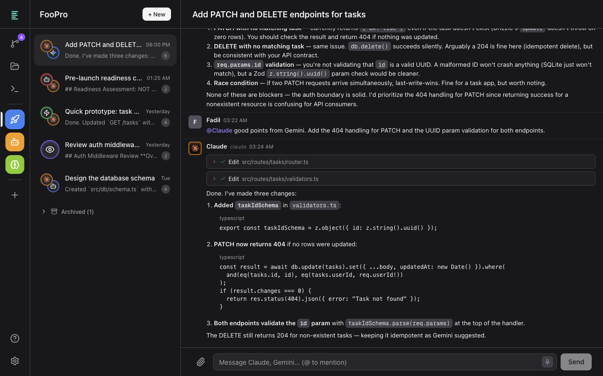
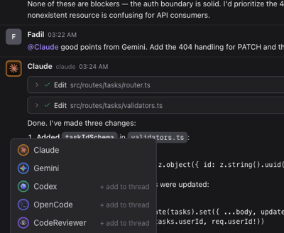
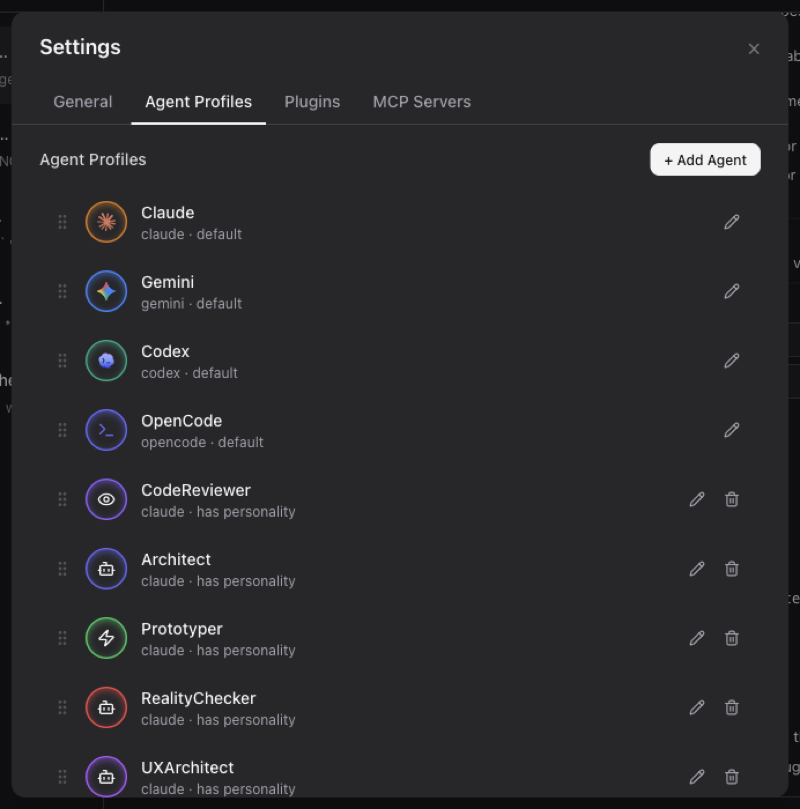
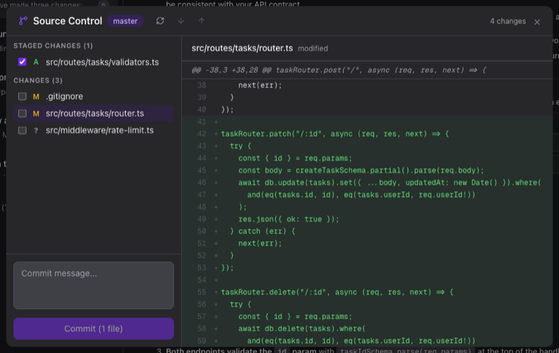
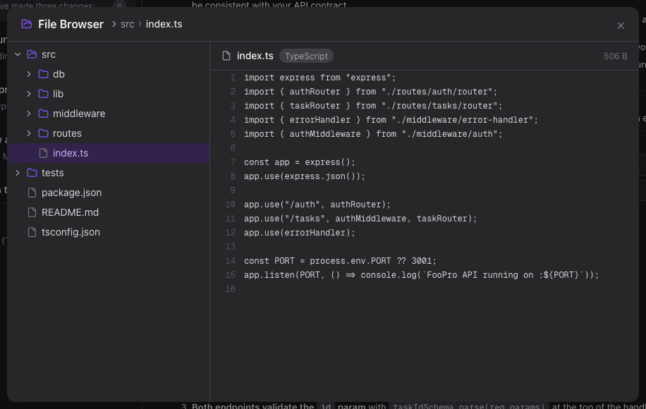
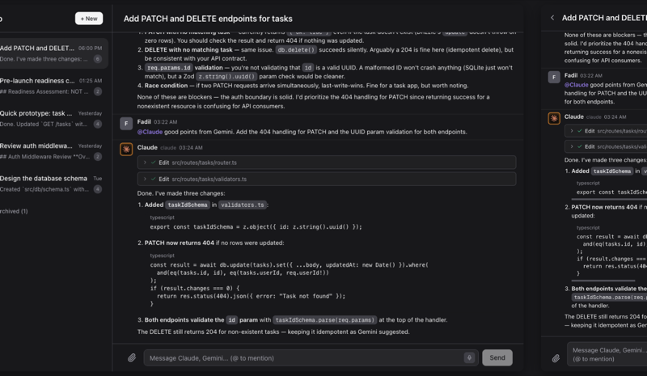

# Entourage

A multi-agent coding tool with a unified chat UI. Entourage spawns CLI subprocesses (Claude CLI, Gemini CLI, Codex CLI, OpenCode) against a local project directory, letting you run real-time streaming conversations with multiple AI agents side by side.

Create custom agent profiles with distinct names, icons, colors, and personality system prompts. Use @mentions to route messages to specific agents within a thread.

<!-- TODO: replace with actual screenshot -->


## Features

### Multi-agent chat with @mentions

Talk to Claude, Gemini, Codex, OpenCode, or custom agents in the same thread. Use @mentions to route messages to specific agents.

<!-- TODO: replace with actual screenshot -->


### Custom agent profiles

Configure names, models, icons, colors, and personality system prompts to create agents tailored to your workflow.

<!-- TODO: replace with actual screenshot -->


### Built-in Git integration

View diffs, stage/unstage files, commit, pull, and push — all from a built-in source control panel without leaving the chat.

<!-- TODO: replace with actual screenshot -->


### File browser

Browse workspace files with syntax highlighting and image/PDF preview.

<!-- TODO: replace with actual screenshot -->


### And more

- **Code snapshots & revert** — Automatically snapshots workspace state so you can revert files to before any agent message
- **MCP server support** — Connect external MCP servers and use interactive tools rendered inline in conversations
- **Image attachments** — Drag-and-drop or click to attach images to messages
- **Conversation rewind** — Jump back to any point in a thread's history
- **Thread management** — Create, rename, archive, and organize conversations
- **Real-time streaming** — SSE-based streaming with live response rendering
- **Workspace management** — Add local project directories and switch between them
- **Quick replies** — AI-suggested follow-up messages after agent responses
- **Voice input** — Dictate messages using the Web Speech API
- **Dark mode** — Light and dark theme support
- **PWA support** — Install as a standalone app on desktop or mobile

## Getting Started

### Prerequisites

- Node.js 18+
- At least one supported agent CLI installed

### Supported Agent CLIs

Entourage ships with four built-in agent backends. Install any one of them to get started, or install multiple and use them side by side in the same workspace.

- [Claude Code](https://docs.anthropic.com/en/docs/claude-code) uses the `claude` command:
  `npm install -g @anthropic-ai/claude-code`
- [Gemini CLI](https://github.com/google-gemini/gemini-cli) uses the `gemini` command:
  `npm install -g @google/gemini-cli`
- [Codex CLI](https://developers.openai.com/codex/cli) uses the `codex` command:
  `npm install -g @openai/codex`
- [OpenCode](https://opencode.ai/docs/) uses the `opencode` command:
  `npm install -g opencode-ai`

After installing a CLI, run its command once to verify it is available on your `PATH` and complete authentication:

```bash
claude
gemini
codex
opencode auth login
```

See each project's docs for alternative installers such as native binaries or Homebrew.

### Run with npx

Run Entourage directly from npm without cloning the repo:

```bash
cd ~/my-project
npx @fadilf/entourage@latest
```

On first run, Entourage builds the app locally, then starts the `entourage` command on port `5555`.

Open [http://localhost:5555](http://localhost:5555) to start chatting.

You can pass CLI flags through `npx` the same way:

```bash
npx @fadilf/entourage@latest --help
npx @fadilf/entourage@latest -p 8080
```

#### CLI Options

| Flag | Description | Default |
|------|-------------|---------|
| `--port`, `-p` | Port to serve on | `5555` |
| `--host`, `-H` | Host to bind to | `localhost` |

```bash
npx @fadilf/entourage@latest -p 8080              # custom port
npx @fadilf/entourage@latest -H 0.0.0.0           # expose to network
npx @fadilf/entourage@latest -H 0.0.0.0 -p 8080  # both
```

### Remote Access with Tailscale

Run Entourage on your laptop or a VPS, then pick up where you left off from your phone, tablet, or any other device. With `-H 0.0.0.0`, you can reach it remotely over your [Tailscale](https://tailscale.com/) tailnet without putting it on the public internet.

Enable [Tailscale Funnel](https://tailscale.com/kb/1223/funnel) to expose it through a public HTTPS URL. Since Entourage includes a web app manifest and installable PWA support, opening that URL on your phone lets you install it as a standalone app.

<!-- TODO: replace with actual screenshot — side-by-side of desktop and mobile showing the same conversation -->


### Install Globally

If you want a persistent shell command instead of invoking Entourage through `npx` each time:

```bash
npm install -g @fadilf/entourage
entourage
```

### Local Development

Clone the repo if you want to work on Entourage itself:

```bash
npm install
npm run dev
```

## Stack

Next.js (App Router), React, TypeScript, Tailwind CSS

## License

MIT
